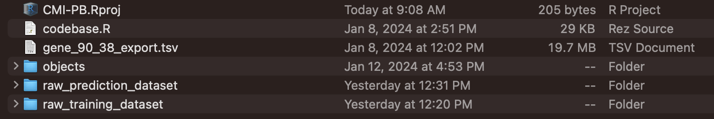
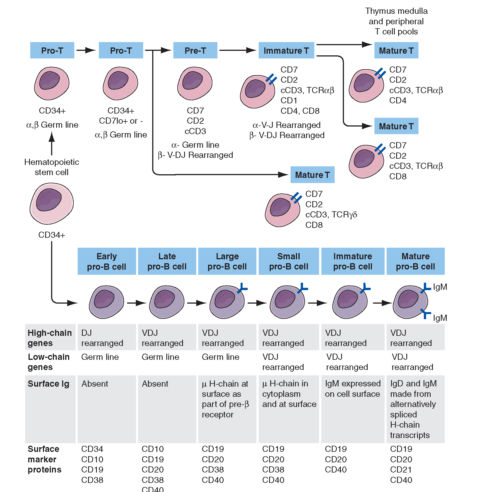
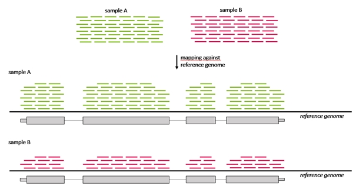

# Grant Lab Rotation
A repository to keep track of progress with CMI-PB Pertussis Modeling Challenge during Grant Lab rotation.

### Data Pre-Processing

For setting up data pre-processing (Step1 and Step2 qmd files), you will need to setup three directories (objects, raw_prediction_dataset, raw_training_dataset) in the working directory prior - as seen below. The raw prediction and training datasets within the respective directories can be found [here](https://www.cmi-pb.org/downloads/cmipb_challenge_datasets/current/2nd_challenge/raw_datasets/) in tsv format. Additionally, for the above qmd files to run, it is imperative 'codebase.R' and 'gene_90_38_export.tsv' must be downloaded in the working directory. These files can be found in this repo. 

The code is adapted from the [CMI-PB GitHub Repo](https://github.com/CMI-PB). 

## Understanding the Biology of the Dataset
### Introduction
To better understand the biological context underlying this dataset, we have provided the following resources, _as a reference_, ordered in a suggested chronological order. 

The overall goal of CMI-PB is to provide a public space for a community to share unique modeling techniques/strategies to allow us to better predict the long-term differences in immune response after Pertussis infection due to differences in childhood vaccination type.  Specifically, CMI-PB collects data from volunteers who have had one of two types of Pertussis vaccines (aP or wP, more on the differences later) that are given a Pertussis vaccination as a proxy for infection (since infecting volunteers with actual Pertussis is highly unethical). Our goal is to use that data to see potential reasons as to why there has been a recent surge in Pertussis cases worldwide, and to better understand and characterize the long-term immune response following vaccination with each individual type of Pertussis vaccine.  

Firstly, we want to understand how vaccines work and why we need it for herd immunity:
[Introduction to Vaccines](https://www.youtube.com/watch?v=rb7TVW77ZCs) (watch up to 3:22) 
[What is herd immunity?](https://www.youtube.com/watch?v=kLUzwT9tWxY)

The following resource summarizes Pertussis, its vaccines, and the CMI-PB project: [Introduction to Pertussis](https://bioboot.github.io/cmi-pb_teaching/background/intro_to_pertussis.html)

This is an optional resource on the timeline and history of Pertussis and societies' responses to the disease: [History of Pertussis](https://bioboot.github.io/cmi-pb_teaching/timeline/pertussis_timeline.html)

### Understanding Terminology in the Dataset
This is a fantastic summary and animation of the basics of the immune system and how it fights an infection. It's very helpful in providing foundation for understanding the rest of this section: [How the Immune System Works](https://www.youtube.com/watch?v=lXfEK8G8CUI)
Note: **bolded** words contain definitions

#### Plasma Antibody Titer
* **Plasma** is the liquid portion of blood. This is where antibodies and cytokine proteins are found.
* **Antigens** are components of a foreign substance that elicits an immune response and antibody production against. For our purposes, it is just a term for a specific bacterial component that our immune system recognizes and produces antibodies against.
* **Antibodies** are proteins that are made from immune cells in our adaptive immunity called B-cells (a PBMC). Each antibody is specific to a given antigen and its function is to mark antigens for removal by other immune cells, and neutralize and encapsulate an antigen (rendering it harmless). This is called opsonization and neutralization, respectively.
* **Titer** is a quantitative measurement for the concentration of antibody.
* Plasma antibody titer **MFI** is mean fluorescent intensity, which is a measure of how much of that given antibody was detected. The **assay** (analytical experiment to determine something) uses MFI as an output used to determine relative antibody titer. You can convert MFI to actual concentration if you wanted, but you would need to run something called a standard in the assay to determine that (it is not provided in this dataset, so we will use MFI).

Our target feature for Plasma Antibody Titer is _MFI_

  
#### Plasma Cytokine Concentration
* **Cytokines** are small proteins secreted especially by macrophages, B cells, T cells, mast cells that are important for cell signaling and communication between cells in the immune system. They can also carry signals to other cells, and can broadly influence immunity, inflammation, cell growth and repair, etc.
* **pg/mL** is simply a unit of measurement for concentration, where pg = picogram (12 orders of magnitude smaller than a gram) per mL of plasma.

* **Lower/Upper limit of quantitation** are values per sample that specify the dynamic range of detection that the assay is sensitive to. In other words, the assay will only detect values above the lower limit of quantitation and below the upper limit of quantitation. The actual values of MFI or concentration are normalized to the lower limit of quantitation, so the lower/upper limit of quantitation are not used as part of our modeling target features.   

Our target feature for Plasma Cytokine Concentration is _pg/mL_

#### PBMC Cell Frequency
Immune cells, along with many cells in our body, carry specialized proteins on the cell surface called receptors. In immune cells, these receptors carry out different functions such as detection of cytokines, signaling molecules, and other immune cell receptors for cell to cell interaction. In immunology, these cell surface receptor proteins are classified by the **cluster of differentiation (CD)** marker. eg CD19, CD4, CD8, etc. The unique composition of cell surface receptors and cluster of differentiation markers allow immunologists to differentiate between different types of immune cells. 

When you come across, for example, CD4+ CD8- expression, it means the cell has CD4 but not CD8. This is a class of T-cell called CD4+ T-cell. 

Even within each class of immune cell, such as our T-cells or B-cells, there is an enormous amount of diversity in receptor composition and thus sub-specializations. The following you _do not need to know_, but illustrates that even in the process of maturing, B-cells and T-cells have very diverse receptor compositions. 

From this, it becomes easy to demonstrate that our dataset has a lot of immune cells, but these are not all the immune cell sub-types in the human. The dataset relies on an assay that detects a finite amount of cell surface receptors and only in the blood (immune cells are everywhere). Everyday, there are new types of immune cells being characterized, and existing immune cell classifications are constantly debated and redefined. For our purposes, we won't need to go that in-depth. Everything we need can be understood through a simple Google search. 

Our target feature for PBMC Cell Frequency is _% live cell_
* This is simply the measure for amount of live immune cells detected in each sub-type.
  

#### PBMC Gene Expression
To understand this dataset, watch the following: [Central Dogma](https://www.youtube.com/watch?v=KIvBn6gfRgY)
--> Each section of DNA that is transcribed into RNA is called a **gene**. This gene, after being . Thus, each protein must come from a specific gene.

* RNA-sequencing (RNAseq) is the assay used to generate data in this dataframe. It provides a comprehensive snapshot of which _genes_ are being actively transcribed and their relative expression levels between samples/patients. The number of RNA for a given gene is called **transcripts**, and differences in RNA transcripts reveals important insights into differences in gene expression, and therefore cellular state and response. In our case, these differences are differences in the transcripts of immune cells found in the blood between patient samples. 
* **tpm** is transcripts per million, which is a method of normalization in RNA sequencing to allow comparison of gene expression levels between samples. This is because, in RNA-seq, transcripts that are read by the machine must be mapped to a reference of genes in the human - called **reference genome**. This is important to understand how many transcripts came from which genes. The number of transcripts mapped to a gene is proportional to its expression level. However, we need normalization because total mapped reads can vary across samples. **tpm** accounts for these differences in total mapped reads by scaling the read counts for each gene to the library size and expressing it as a rate per million reads. It is calculated as: (Reads mapped to a gene / Total mapped reads in sample) x 1,000,000.

For our case, assume sample A and sample B are different specimens from different subjects and have different total reads. The transcripts mapped to each gene (indicated by each grey box) for a given sample must be normalized to its total reads:

Our target feature for PBMC Gene Expression is thus _tpm_

